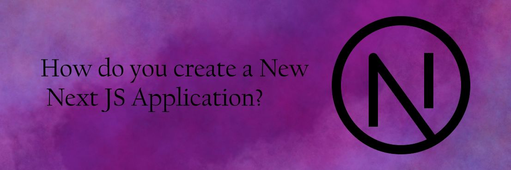

## Go further with Next Js

Hey there, This week ill briefly explain how to create a Nextjs Application and why you would choose Next.js for your project!

### 🛠️ The Swiss Army Knife of Web Dev: Why Next.js Is Your Go-To Tool

Choosing Next.js for your web development needs is like getting a Swiss Army knife for coding—it's versatile and comes packed with essential features. Whether you're building a static site, a full-fledged web app, or something in between, Next.js offers server-side rendering, static site generation, and API routes out of the box. Plus, it has a thriving community and a wealth of plugins, making it a one-stop solution for modern web development.

### 💪 Next Level: Your Next.js Adventure Awaits

To kickstart your Next.js journey, make sure you have Node.js and npm installed. Open your terminal and run npx create-next-app my-next-app to scaffold a new Next.js app called "my-next-app". Once the setup is complete, head over to your new project's directory with cd my-next-app. Start the development server by running npm run dev, and voilà! Your Next.js app will be live at <http://localhost:3000>. Now you're ready to craft dynamic pages with .js or .tsx files in the pages directory, and enjoy the power of Next.js!
