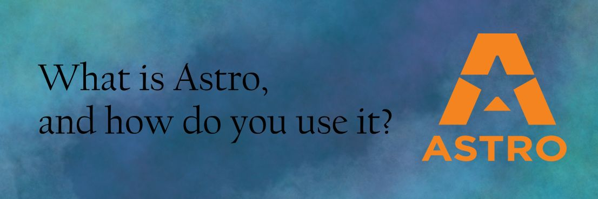

## Travel Through The Stars With Astro

Greetings, intrepid space explorers! Prepare to embark on an intergalactic journey as we unveil Nebulous 2.0, a quantum leap in our quest for seamless navigation through the cosmos of data. Join us as we traverse the celestial landscape, navigating through the stars with ease and precision. Let's dive into the cosmic wonders of pagination in Nebulous 2.0!

### 🌌 Exploring New Horizons: Pagination Enhancements

- **Hyperdrive Pagination:** Say farewell to the constraints of linear navigation! With Nebulous 2.0, embrace the power of hyperdrive pagination, propelling you through vast data sets at warp speed. Navigate effortlessly through nebulae of information, seamlessly transitioning between pages with unparalleled fluidity.

- **Constellation Navigation:** Experience the elegance of constellation navigation, as Nebulous 2.0 introduces a revolutionary approach to browsing. Traverse the cosmic expanse with grace, effortlessly maneuvering between pages while maintaining spatial awareness. Seamlessly hop between celestial bodies of content, guided by the stars of pagination.

- **Interstellar Pagination Controls:** Take command of your journey through the cosmos with interstellar pagination controls. Nebulous 2.0 empowers you with intuitive tools to navigate the vastness of data with precision and ease. From binary stars to quasars of content, effortlessly pinpoint your destination and chart your course with finesse.

### 🛠️ Fine-Tuning the Navigation Instruments: Bug Fixes and Improvements

- **Galactic Stability:** Bid adieu to the glitches and anomalies of the past. Nebulous 2.0 brings stability to the cosmic chaos, with fixes for glitches that once hindered your voyage. Traverse the galaxies with confidence, knowing that your journey will be smooth and uninterrupted.

- **Cosmic Compatibility:** Explore new frontiers with enhanced cosmic compatibility. Nebulous 2.0 ensures seamless navigation across all celestial bodies, from the oldest stars to the youngest planets. Whether you're navigating the asteroid belts of data or surfing the waves of information, Nebulous 2.0 has you covered.

- **Lunar Error Handling:** Navigate through the lunar landscape of errors with ease. Nebulous 2.0 introduces robust error handling mechanisms, ensuring that you can navigate through the occasional asteroid field of errors without losing your bearings. From minor glitches to major anomalies, Nebulous 2.0 keeps you on course.

### 🚀 Beyond the Event Horizon: What Lies Ahead

While Nebulous 2.0 sets a new standard for pagination in the digital cosmos, our journey is far from over. Join us as we continue to push the boundaries of navigation, exploring new galaxies of possibilities. From wormholes of innovation to black holes of discovery, the future of pagination in Nebulous is as vast and infinite as the cosmos itself.

### 🌠 Navigate the Nebulous Universe with Ease

Join us as we embark on this cosmic voyage through the stars of pagination. With Nebulous 2.0 as your guide, navigating the digital universe has never been more exhilarating. Strap in, stargazers, and prepare to explore the boundless wonders of pagination in Nebulous 2.0!
